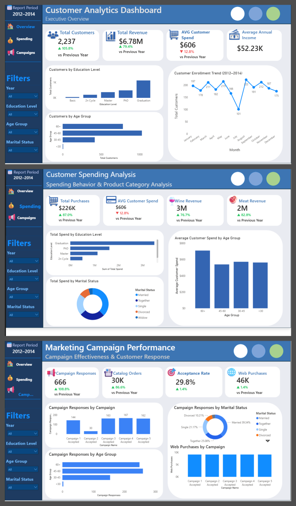
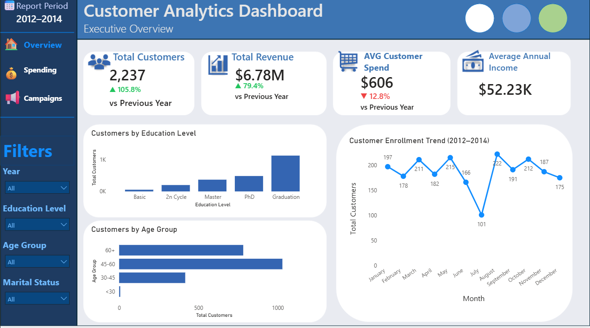
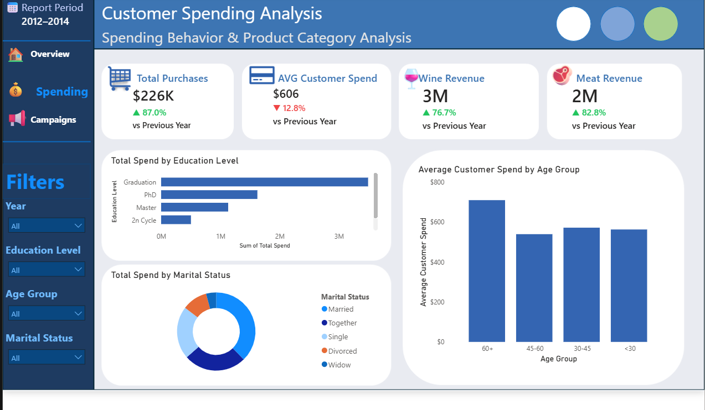
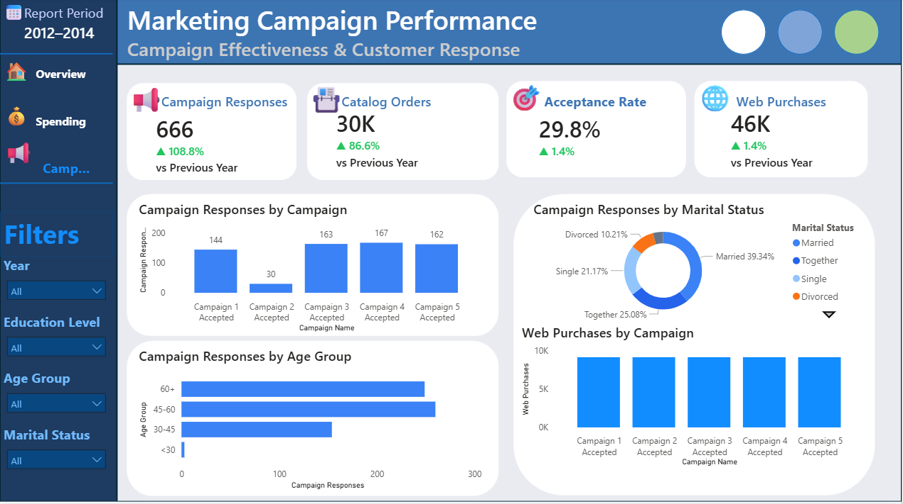

# 📊 Customer Analytics Dashboard | SQL • Python • Power BI

An end-to-end Customer Analytics project built using **SQL, Python, and Microsoft Power BI** to analyze customer demographics, spending behavior, purchasing patterns, and marketing campaign performance.

This project demonstrates the complete data analytics workflow—from data extraction and exploration in SQL, through data cleaning and feature engineering in Python, to interactive dashboard development in Power BI.

---

# 🚀 Project Overview

Businesses need to understand customer behavior to improve marketing strategies, increase sales, and identify valuable customer segments.

This project analyzes customer data to answer questions such as:

- Who are the highest-value customers?
- Which customer segments generate the most revenue?
- Which marketing campaigns perform best?
- How do demographics influence spending?
- Which purchasing channels are most popular?
- # 📊 Customer Analytics Dashboard | SQL • Python • Power BI

An end-to-end Customer Analytics project built using SQL, Python, and Microsoft Power BI.



---

# 🛠 Tools & Technologies

- **SQL (MySQL / XAMPP phpMyAdmin)** – Data exploration and business queries
- **Python**
  - Pandas
  - NumPy
  - Matplotlib
- **VS Code**
- **Microsoft Power BI**
- **DAX**
- **Git & GitHub**

---

# 📂 Project Workflow

```
Raw Dataset (CSV)
        │
        ▼
SQL (MySQL / XAMPP)

• Data Validation
• Business Queries
• KPI Calculation
• Data Exploration

        │
        ▼

Python (VS Code)

• Missing Value Handling
• Data Cleaning
• Feature Engineering
• Exploratory Data Analysis (EDA)
• Data Visualization
• Export Clean Dataset

        │
        ▼

Power BI

• Data Modeling
• DAX Measures
• Interactive Dashboard
• KPI Cards
• Business Insights
```

---

# 📁 Repository Structure

```
Customer-Analytics-Dashboard/

│
├── README.md
├── customer_analysis.py
├── customer_marketing_queries.sql
├── cleaned_marketing_campaign.csv
├── marketing_campaign.csv
├── Customer Analytics Dashboard.pbix
│
├── Dashboard Images/
│   ├── Overview Dashboard.png
│   ├── Spending Dashboard.png
│   ├── Campaign Dashboard.png
│   └── Full Dashboard.png
│
├── SQL Screenshots/
│   ├── 01_Total_Customers.png
│   ├── 02_Total_Revenue.png
│   ├── 03_Average_Income.png
│   ├── ...
│
├── Python EDA/
│   ├── purchase_channels.png
│   ├── income_vs_spending.png
│   ├── spending_distribution.png
│   └── education_boxplot.png
│
└── Video Demo/
    └── Customer Analytics Dashboard Demo.mp4
```

---

# 🗄 SQL Data Exploration

The raw dataset was first imported into **MySQL (XAMPP/phpMyAdmin)** where SQL was used to explore and validate the data before cleaning it in Python.

Tasks performed include:

- Total customer count
- Revenue calculations
- Average income
- Customer segmentation
- Spending analysis
- Campaign performance
- Purchase channel analysis
- Business KPI calculations

Example:

```sql
SELECT
SUM(
MntWines +
MntFruits +
MntMeatProducts +
MntFishProducts +
MntSweetProducts +
MntGoldProds
) AS Total_Revenue
FROM marketing_campaign;
```

SQL screenshots are available inside the **SQL Screenshots** folder.

---

# 🐍 Python Data Cleaning & Feature Engineering

Python was used to clean and prepare the dataset before importing it into Power BI.

Tasks completed:

- Filled missing income values
- Removed unrealistic ages
- Standardized marital status values
- Created Age column
- Created Age Groups
- Created Total Spend
- Created Total Purchases
- Created Customer Value Segments
- Created Recency Segments
- Created Customer Tenure
- Exported cleaned dataset

Libraries used:

- Pandas
- NumPy
- Matplotlib

---

# 📈 Exploratory Data Analysis (EDA)

Several visualizations were created in Python to better understand customer behavior.

Examples include:

- Spending Distribution
- Spending by Education Level
- Income vs Spending
- Purchase Channel Comparison

---

# 📊 Power BI Dashboard

The dashboard consists of three interactive report pages.

## Page 1 — Executive Overview

KPIs

- Total Customers
- Total Revenue
- Average Customer Spend
- Average Annual Income

Visuals

- Customers by Education
- Customers by Age Group
- Customer Enrollment Trend

---

## Page 2 — Customer Spending Analysis

KPIs

- Total Purchases
- Average Customer Spend
- Wine Revenue
- Meat Revenue

Visuals

- Spending by Education
- Spending by Marital Status
- Average Spending by Age Group

---

## Page 3 — Marketing Campaign Performance

KPIs

- Campaign Responses
- Catalog Orders
- Acceptance Rate
- Web Purchases

Visuals

- Campaign Responses by Campaign
- Campaign Responses by Age Group
- Campaign Responses by Marital Status
- Web Purchases by Campaign

---

# 📌 Key Insights

- Customers with higher education generally spend more.
- Middle-aged customers contribute a significant share of revenue.
- Wine and meat products generate the highest product revenue.
- Web purchases represent a major sales channel.
- Campaign acceptance varies across customer demographics.

---

# 📸 Dashboard Preview

## Executive Overview



---

## Customer Spending Analysis



---

## Marketing Campaign Performance



---
# 🎥 Dashboard Walkthrough

A short video demonstration of the interactive dashboard is available below.

▶️ **[Watch the Dashboard Demo](video/customer-analytics-dashboard-demo.mp4)**

# 📈 Skills Demonstrated

- SQL
- Data Cleaning
- Feature Engineering
- Exploratory Data Analysis
- Business Intelligence
- Data Visualization
- Dashboard Design
- DAX
- Power BI
- Python
- Data Storytelling

---

# 👨‍💻 About Me

**Chijioke Chisom**

Aspiring Data Analyst passionate about transforming raw data into actionable business insights using SQL, Python, Excel, and Power BI.

---

# 📬 Connect With Me

**LinkedIn:**
https://linkedin.com/in/chisom-chijioke-68a08a263

**GitHub:**
https://github.com/chijiokechisom2002-source

**Upwork:**
https://www.upwork.com/freelancers/~01b66f9f94aa8d83c2

---

⭐ If you found this project interesting, feel free to star this repository.
